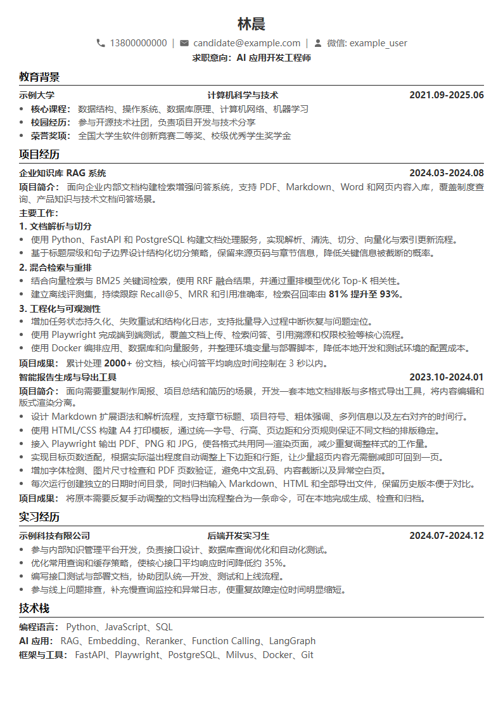

# 本地简历渲染器

**简体中文** | [English](README_EN.md)

> **纯 Vibe Coding 产物**

一个主打高审美黑白风格的本地 Markdown 简历渲染器。它不依赖花哨配色和装饰组件，而是通过字体层级、留白、横线、粗体和严谨对齐建立清晰的信息秩序，兼顾屏幕阅读、黑白打印和正式投递。

项目使用 HTML/CSS 和 Playwright 导出 PDF、PNG、JPG 与 HTML，并提供可被 Codex 调用的中文 Skill。

## 复制给 AI，一键安装

现在不必手动照着安装文档逐条执行。把下面整段提示词复制到 **Codex、Claude Code 或其他具备终端和文件操作能力的 AI 编程工具**中：

```text
请帮我安装、配置并验证本地简历渲染器：
https://github.com/oneclickwork/local-resume-renderer

请尽量自动执行，不要只复述 README。要求：

1. 先识别当前运行环境、操作系统，以及自己是 Codex、Claude Code 还是其他 AI 编程工具。
2. 如果是 Codex：
   - 优先执行 codex plugin marketplace add oneclickwork/local-resume-renderer。
   - 如果当前 Codex 只有 marketplace 管理命令、不能直接安装插件，不要停在这里让我手动处理。请把仓库克隆到稳定的本地工具目录，并将 plugins/local-resume-renderer/skills/resume-renderer 以符号链接或目录联接的方式安装到当前 Codex 能识别的用户级 Skills 目录。
3. 如果是 Claude Code：
   - 执行 claude plugin marketplace add oneclickwork/local-resume-renderer。
   - 执行 claude plugin install local-resume-renderer@local-resume-tools --scope user。
   - 安装后执行插件重载；如果当前会话无法重载，明确告诉我需要新建会话。
4. 如果是其他 AI 编程工具，请克隆仓库，并建立它支持的持久化 Skill、Command 或规则入口；不要修改项目核心渲染逻辑。
5. 找到实际的插件根目录，运行 npm install 和 Playwright Chromium 安装命令。不要把 node_modules 提交到 Git。
6. 使用仓库中的 examples/example-resume.md 执行一次 --fit-pages 1 测试。
7. 确认生成 PDF、PNG、JPG、HTML 和输入 Markdown 副本，检查 PDF 页数与图片排版。
8. 不要读取、上传或提交机器上的私人简历；测试只能使用仓库匿名样例。
9. 完成后告诉我：安装位置、调用名称、测试输出目录，以及以后更新项目的方法。

安装成功后，立即调用该简历渲染能力完成匿名样例测试。
```

## 最省事的使用方式

安装完成后，把自己的旧简历文件拖进 AI 对话，或者把文件路径填入下面提示词。AI 会读取本项目的匿名样板，把你的真实内容填入相同结构，然后直接渲染：

使用者只需要提供 **原简历、目标岗位和期望页数**，不需要学习项目的 Markdown 扩展语法，也不需要手动调整 CSS。目标岗位暂时不确定时可以省略，AI 会优先忠实迁移原简历内容。

```text
请调用已安装的 resume-renderer 简历渲染能力。

我的简历文件：<填写文件路径，或者直接读取我在对话中附加的简历>
目标岗位：<填写目标岗位>
期望页数：1

执行要求：
1. 找到简历渲染器中的 examples/example-resume.md，读取它的结构、排版语法和内容组织方式。
2. 读取我的原简历，提取教育经历、工作或实习经历、项目经历、技术栈和可量化成果。
3. 使用样板结构生成一份新的 Markdown 简历。可以优化表达和内容顺序，但不得编造公司、项目、技术、时间或数据。
4. 保留原简历文件不动，不要覆盖；将新 Markdown 作为独立文件保存。
5. 中文内容使用简洁、专业、适合技术岗位的表达；项目描述优先突出职责、方案、技术和结果。
6. 调用渲染器输出 PDF、PNG、JPG 和 HTML，并把输入 Markdown 一起归档到新的日期时间目录。
7. 优先使用 --fit-pages 1；如果安全压缩后仍无法放入一页，不要擅自删除重要经历，先说明原因。
8. 检查 PDF 页数、中文字体、左右对齐、分页、底部留白以及是否存在重叠或截断。
9. 最后给我全部输出文件的可访问路径，并简要说明你对原简历做了哪些内容优化。
```

## 效果预览



> 效果图使用匿名示例数据生成，完整输入见 `plugins/local-resume-renderer/examples/example-resume.md`。

## 功能

- 将 Markdown 简历渲染为 A4 PDF 和图片。
- 支持联系方式图标、分节标题、粗体、列表和多列信息行。
- 支持左右对齐的公司、职位、项目名称和时间。
- 支持自动压缩到指定页数，不缩小字号、不删除内容。
- 每次生成独立的日期时间目录，同时归档输入 Markdown。
- Playwright 不可用时可回退到 Python ReportLab + Poppler。

## 安装

进入渲染器目录：

```powershell
cd plugins/local-resume-renderer
npm install
npx playwright install chromium
```

## 使用

默认从最新输出版本读取 Markdown；没有历史版本时使用 `examples/example-resume.md`：

```powershell
npm run render
```

指定输入：

```powershell
npm run render -- --input "C:\path\resume.md"
```

自动压到一页：

```powershell
npm run render -- --fit-pages 1
```

使用紧凑预设或手动参数：

```powershell
npm run render -- --compact
npm run render -- --page-margin-y 6 --line-height 1.30
```

默认输出到当前用户桌面的 `resume/<日期时间>`。可以通过环境变量修改输出根目录：

```powershell
$env:RESUME_OUTPUT_ROOT = "D:\resume-output"
npm run render
```

## Markdown 扩展语法

```markdown
::左右 **示例科技有限公司** || **2024.07-2024.12**

::: start
**示例大学**
:::
**计算机科学与技术**
:::
**2021.09-2025.06**
::: end
```

完整示例见 `plugins/local-resume-renderer/examples/example-resume.md`。

## AI 编程助手集成

Plugin 内包含中文 `resume-renderer` Skill，同时支持 Codex 和 Claude Code。

### Codex

```powershell
codex plugin marketplace add oneclickwork/local-resume-renderer
```

重启 Codex，在插件目录中选择“本地简历工具”并安装 `local-resume-renderer`。之后可以直接说：

```text
调用 $resume-renderer，把最新简历压到一页。
```

### Claude Code

```bash
claude plugin marketplace add oneclickwork/local-resume-renderer
claude plugin install local-resume-renderer@local-resume-tools --scope user
```

安装后运行 `/reload-plugins`，然后使用：

```text
/local-resume-renderer:resume-renderer 把最新简历压到一页
```

Skill 会定位自己的 Plugin 安装目录、选择渲染参数、生成新时间版本并检查输出。

## 隐私

不要把真实简历、手机号、邮箱、微信号或生成的 PDF/图片提交到公开仓库。仓库只保留匿名示例；个人输入和输出应保存在仓库外部或被 `.gitignore` 排除。

## 许可证

[MIT](LICENSE)
